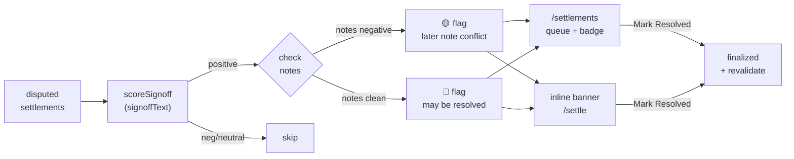
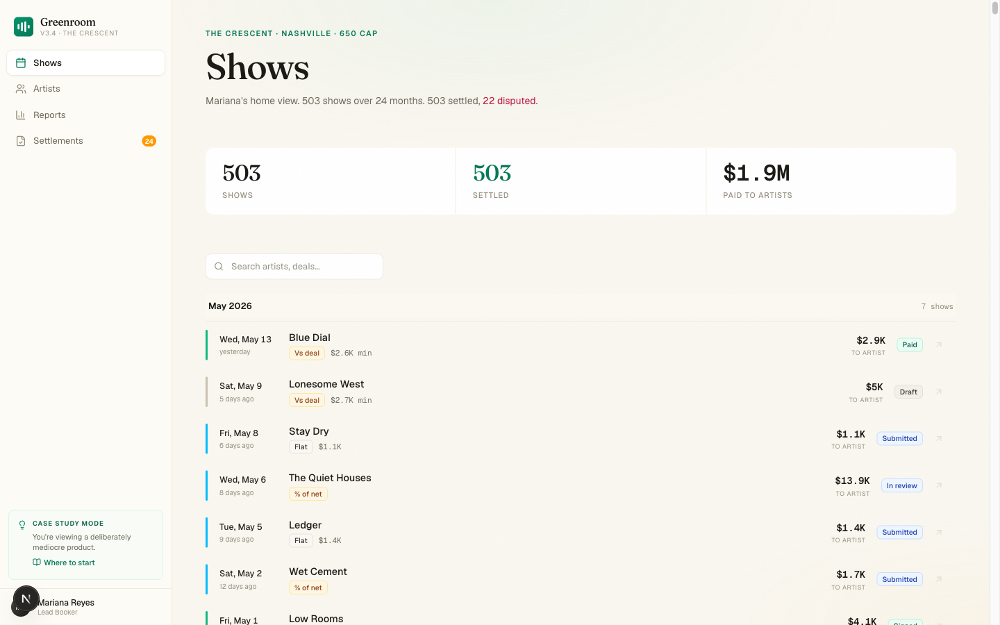
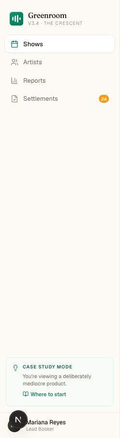
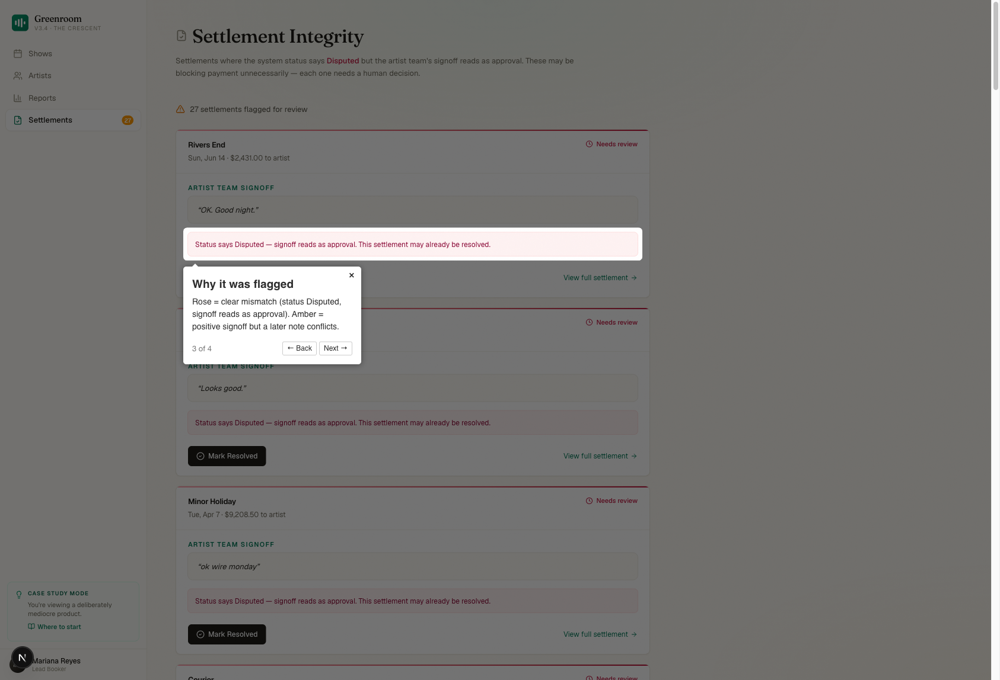
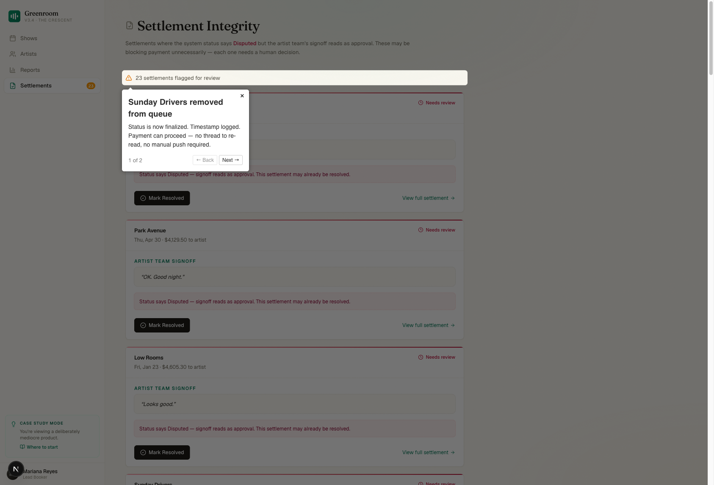
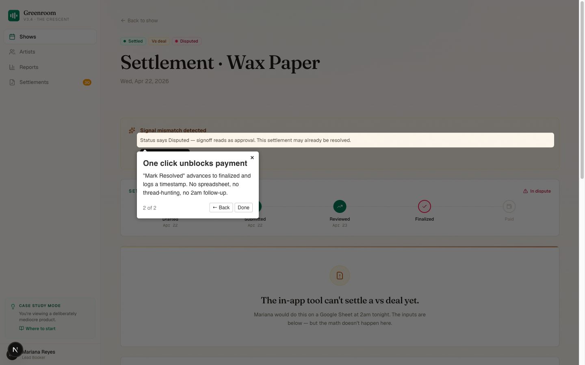
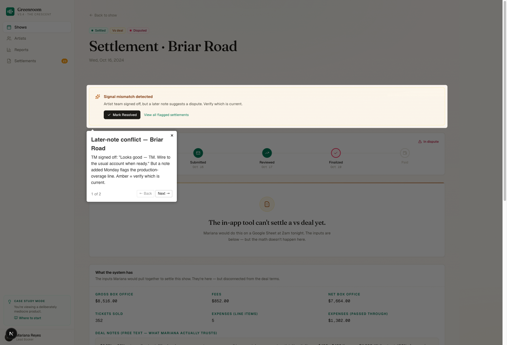
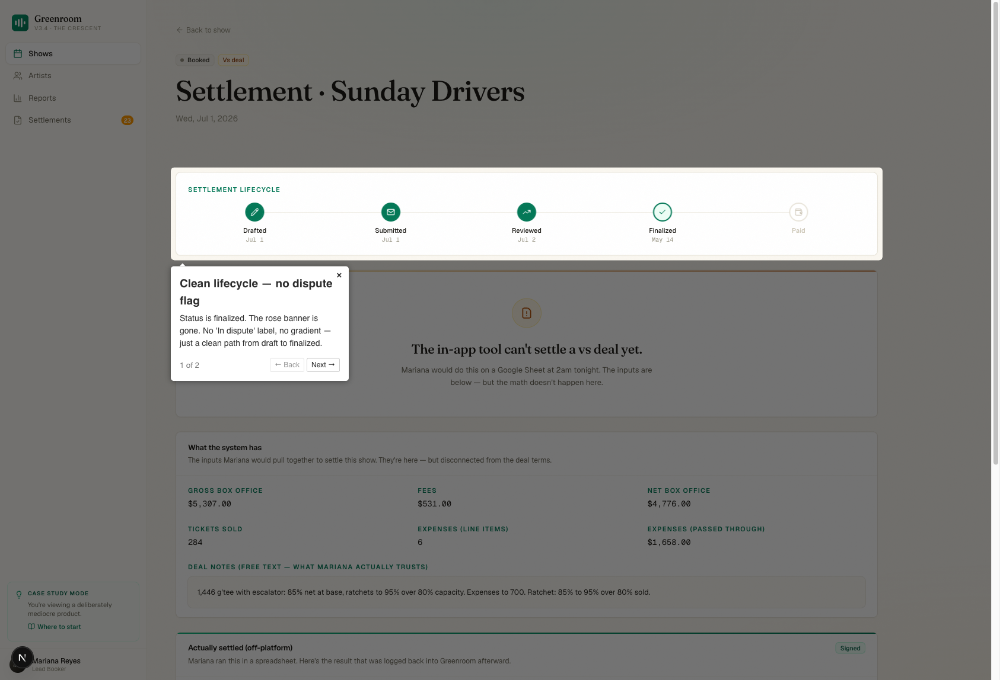

# Settlement Signal Integrity
### Applied AI PM Case Study — PRD Memo
**Candidate:** David Almeida · **Date:** May 2026 · **Venue:** The Crescent (650-cap, Nashville)

**Demo:** [Watch on Loom](https://www.loom.com/share/881f7372f3a8432884a5958bbfccc890) · **Repo:** [DavidVique1998/greenroom-starter](https://github.com/DavidVique1998/greenroom-starter)

---

## Context

Pri Iyer's Q4 memo put it plainly: *"We are winning on completeness and losing on craft."* The settlement experience is the sharpest edge of that gap — 82% of Greenroom customers run settlements in spreadsheets, not in the product. The Crescent is in that 82%.

Mariana Reyes, the lead booker, described her Friday night ritual: open Greenroom for deal terms, open a Google Sheet for the math, copy-paste between them at 2am. She switched to spreadsheets in 2023 because the in-app tool can't handle Vs deals (roughly 70% of The Crescent's deal mix). The math gets done somewhere else. The trust between the venue and the artist is built somewhere else. Greenroom isn't in that room.

This case study doesn't fix Vs deals — that's a sprint by itself. It fixes something that's costing Mariana money and agent goodwill right now, today, with the data she already has.

---

## The Problem

Mariana has settlements stuck in `disputed` status that the artist team has already approved. The database shows it plainly: signoff texts like *"Looks good — TM"*, *"👍"*, *"ok wire monday"*, and *"OK. Good night."* sitting next to `status = disputed`.

These aren't edge cases. At least four settlements in the current data set are in this state, each one blocking a payment that the artist already signed off on. From Mariana's perspective, every one of these is invisible friction — she has to remember to go back, find the show, re-read the thread, and manually push it forward. The system is supposed to help her close loops. Instead it's creating them.

> *"I want fewer surprises in that 2am conversation. Most of the friction comes from things that were knowable on Wednesday."*
> — Mariana Reyes, Lead Booker interview

The downstream costs are real:
- **Cash flow risk.** Delayed payments strain artist relationships and can trigger agent escalation — as happened in the Coastal Spell dispute in March 2025, which started with a stale settlement status, not an actual disagreement, and cost the venue $720 plus several hours of Marcus and Mariana's time.
- **Cognitive overhead.** Mariana has to re-context-switch into a settlement she mentally closed weeks ago.
- **Audit confusion.** A `disputed` status that reads as resolved in the signoff creates ambiguity for Marcus and Pri when they look at the numbers.

*(See Appendix — Fig. 1: Shows home · Fig. 2: Sidebar badge)*

---

## Why This Slice

Four alternatives were on the table:

| Slice | Signal | Risk | Why cut |
|---|---|---|---|
| **Vs-deal math repair** | High impact, most shows break here | Very high | Every Vs flavor (walkout pots, tier ratchets, % of gross) needs its own calculation path. Shipping bad math is worse than no math. Needs its own sprint. |
| **Real-time dispute prediction** | Interesting | High | Requires an ML pipeline or LLM API call on every save event. No runnable prototype without infra. Can't validate it without historical outcome labels. |
| **Agent comm drafting** | Mariana asked for this in her interview | Medium | A draft message is only trustworthy if the underlying status is accurate. This slice unblocks that one. |
| **Signal integrity (chosen)** | Directly unblocks payments | Low | Heuristic-only, no API key, immediately actionable, human still makes the final call. |

Signal integrity wins because it's the smallest intervention with the clearest outcome. Every resolved flagged settlement is a payment unblocked. The value is denominated in dollars and time, not engagement metrics.

The Coastal Spell dispute is the right frame: that situation started as a stale-status problem layered on an ambiguous deal term. The deal ambiguity is a harder problem. The stale status is solvable today.

---

## What I Built

A three-surface feature that surfaces status/signoff mismatches and gives Mariana one click to resolve them.

Every disputed settlement passes through the signal classifier. If the signoff text scores positive, the system checks internal notes — clean notes produce a rose flag (clear mismatch, payment is blocked for no reason), conflicting notes produce an amber flag (signoff positive but a later note raised a question). Flagged settlements surface in two places: the `/settlements` audit queue with a nav badge showing queue depth, and an inline banner directly on the settlement page. Either surface lets Mariana mark the settlement resolved in one click, which advances status to `finalized`, logs a timestamp, and decrements the badge — no spreadsheet, no manual follow-up.

### 1. Signal Classifier (`lib/signalScore.ts`)

Heuristic keyword matching classifies signoff text as `positive`, `negative`, or `neutral`. Positive patterns include approval language ("looks good", "ok", "wire monday", 👍, "confirmed", "approved"). Negative patterns catch live dispute language ("disputing", "wrong", "doesn't add up", "hold on", "issue").

`detectMismatch()` flags a settlement when `status === "disputed"` and the signoff scores positive. It also checks the internal notes field — if notes contain negative signals *after* a positive signoff, the reason text shifts from "may already be resolved" to "verify which is current." This distinction drives the amber vs. rose accent on each card.

**Why heuristic over LLM:** Runnable with zero infrastructure. The false-negative case (missing a real mismatch) is tolerable — status quo is the fallback. The false-positive case (flagging something genuinely disputed) is handled by the "human decision required" framing — Mariana reads the card and decides. No automated action happens without her.

### 2. Settlements Audit Page (`/settlements`)

A dedicated queue of all flagged settlements. Each card shows:
- Artist name, show date, amount to artist
- The full quoted signoff text (italic, quoted — verbatim, uninterpreted)
- The reason the system flagged it (rose = clear mismatch, amber = later-note conflict)
- "Mark Resolved" (advances to `finalized`, logs timestamp) and "View full settlement" link

The page was intentionally kept simple. No filters, no sorting, no bulk actions. The goal for V1 is to make the queue visible and to make each resolution deliberate. A bulk-resolve button would let Mariana clear the queue without reading the cards — that's the wrong behavior.

Empty state is a positive signal: "No mismatches detected." Mariana can glance at the nav badge, see zero, and move on.

*(See Appendix — Fig. 3: Audit queue · Fig. 4: After resolve)*

### 3. Inline Banner on Settlement Pages

*(See Appendix — Fig. 5: Rose banner · Fig. 6: Amber banner · Fig. 7: Finalized state)*

When Mariana navigates directly to a disputed settlement's detail page, the integrity banner appears above the lifecycle bar — before the numbers, not buried at the bottom. She doesn't have to know the audit page exists to catch it.

The banner surfaces the same reason text and the same "Mark Resolved" action. Both surfaces use the same server action; revalidation hits both `/settlements` and the specific show's settle page.

### 4. Nav Badge

The Settlements nav item shows an amber count badge when flagged settlements exist. Mariana sees it without going looking. The count clears when the queue empties. Badge and page count stay in sync on every resolve — `revalidatePath("/", "layout")` ensures the root layout refreshes along with the page.

---

## What Was Cut (and Why)

**Bulk resolve.** Each settlement is real money. Mariana should read every card. A bulk action optimizes for throughput over accuracy — wrong tradeoff for a payment action.

**LLM-based classification.** Would improve accuracy on ambiguous text, but requires an API key, adds ~300ms latency per settlement load, and creates a dependency on uptime. Keyword matching handles every case in the current seed data correctly. Revisit when we have false-positive data.

**"Flagged since" timestamp.** High value (aging shows urgency), but it requires either a new `flaggedAt` column or tracking when the status/signoff diverged — more schema work than V1 warrants.

**Notification on new mismatch.** Natural next step. Mariana shouldn't have to remember to check the page. Slack integration or email digest would close this. Deferred because it needs a notification infrastructure decision.

**Draft message to artist after resolve.** A composable follow-on: once the status updates to `finalized`, surface a suggested note to the artist confirming the settlement closed. Deferred — the resolution action itself is the trust signal, not the message. Mariana flagged this as a want in her interview; it's next in the queue.

---

## Validation Plan

**Week 1 (internal):**
- Manually audit the 4 flagged settlements in the seed data. Verify the flag reason text is accurate for each.
- Check for false positives by sampling 10 non-flagged disputed settlements and reading their signoff text. Any misses?
- Shadow Mariana (or a proxy) clearing the queue. Does she hesitate before clicking "Mark Resolved"? Why?

**Week 2–4 (live):**
- **Primary metric:** Time from settlement entering `disputed` to `finalized`, for settlements that pass through the flag queue vs. those that don't.
- **Secondary metric:** False positive rate — settlements resolved via "Mark Resolved" that later get re-opened or questioned. Target: <5%.
- **Coverage metric:** % of flagged settlements resolved within 48 hours of appearing in the queue.

**What would change the design:**
- If Mariana regularly opens the "View full settlement" link before resolving, the inline preview on the card isn't sufficient. Add a collapsible deal summary.
- If false positive rate is >10%, add a "This is still disputed" action alongside "Mark Resolved" so negative signal is explicit.
- If the queue consistently has >10 items, add filtering by age and artist tier.

---

## What Ships Next

**Immediate (this sprint):**
1. Aging indicator — how long has this been flagged? Red after 7 days.
2. Extend detection to other mismatch types: `finalized` status + negative notes, `paid` status + outstanding recoup dispute.

**Next sprint:**
3. Notification when new mismatches appear (Slack webhook, configurable threshold).
4. Draft confirmation message to artist after resolution ("Settlement for [Show] is now finalized — wiring [amount] to [account] by [date]"). This directly addresses what Mariana asked for.

**This quarter:**
5. Connect the signal classifier to the deal math repair work. When Mariana submits a revised settlement that fixes the amount, auto-check if the new figure matches the signoff text's expected direction before advancing status.
6. Vs-deal math repair — this is the larger unlock. Signal integrity is the foundation; the payment numbers need to be right before we automate anything further downstream. This is what closes the gap with Pri's 82% stat.

---

## Appendix: Files Changed

| File | Change |
|---|---|
| `lib/signalScore.ts` | New — classifier + mismatch detector |
| `lib/queries.ts` | Added `getFlaggedSettlements()` + `FlaggedSettlement` type |
| `app/settlements/page.tsx` | New — audit queue page |
| `app/settlements/actions.ts` | New — `resolveSettlement` server action |
| `app/shows/[id]/settle/page.tsx` | Added integrity banner above lifecycle bar |
| `components/layout/nav-links.tsx` | Added Settlements nav item + badge prop |
| `components/layout/sidebar.tsx` | Made async, fetches flagged count, passes to nav |

Build passes clean. No external dependencies added. Works with `npm run dev`, no API keys required.

---

## Appendix: Screenshots

<table style="width:100%;table-layout:fixed;"><tr>
<td style="width:50%;padding-right:8px;vertical-align:top;"> <strong>Fig. 1</strong> — Shows home. The Settlements nav item with badge is the new entry point.</td>
<td style="width:50%;padding-left:8px;vertical-align:top;"> <strong>Fig. 2</strong> — Sidebar badge. Queue depth visible at a glance, no navigation required.</td>
</tr></table>

<table style="width:100%;table-layout:fixed;"><tr>
<td style="width:50%;padding-right:8px;vertical-align:top;"> <strong>Fig. 3</strong> — Audit queue. Verbatim signoff, flag reason, and one-click resolve per card.</td>
<td style="width:50%;padding-left:8px;vertical-align:top;"> <strong>Fig. 4</strong> — After "Mark Resolved." Sunday Drivers removed, nav badge decrements.</td>
</tr></table>

<table style="width:100%;table-layout:fixed;"><tr>
<td style="width:50%;padding-right:8px;vertical-align:top;"> <strong>Fig. 5</strong> — Rose banner. Status says Disputed, signoff reads as approval.</td>
<td style="width:50%;padding-left:8px;vertical-align:top;"> <strong>Fig. 6</strong> — Amber banner. Signoff positive but a later note flags a dispute.</td>
</tr></table>

<table style="width:100%;table-layout:fixed;"><tr>
<td style="width:100%;vertical-align:top;"> <strong>Fig. 7</strong> — After "Mark Resolved." Rose banner gone, lifecycle bar shows Finalized with timestamp.</td>
</tr></table>
